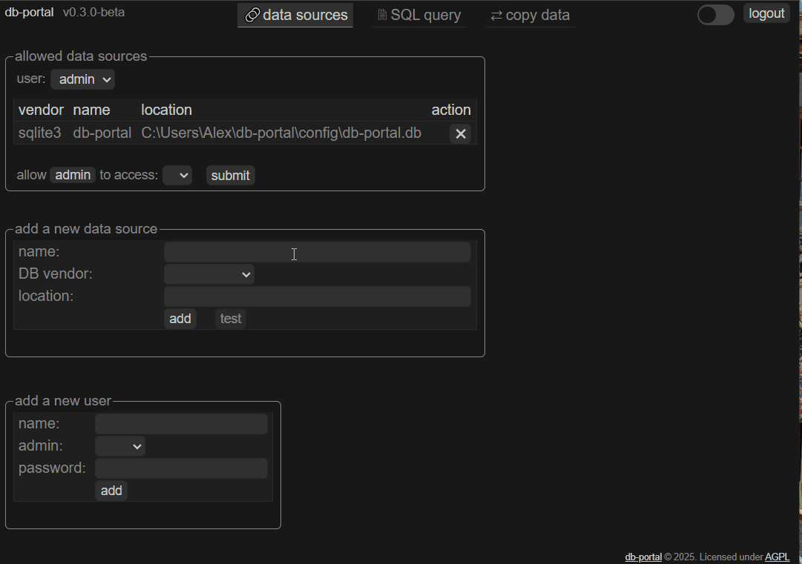
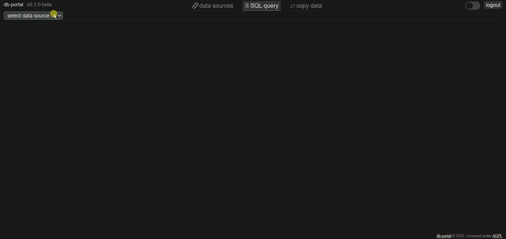
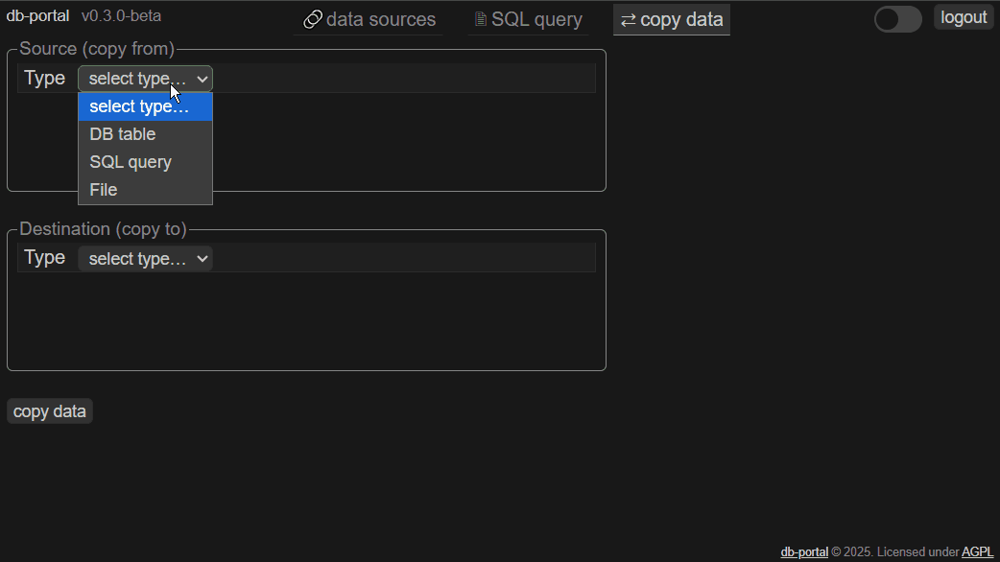
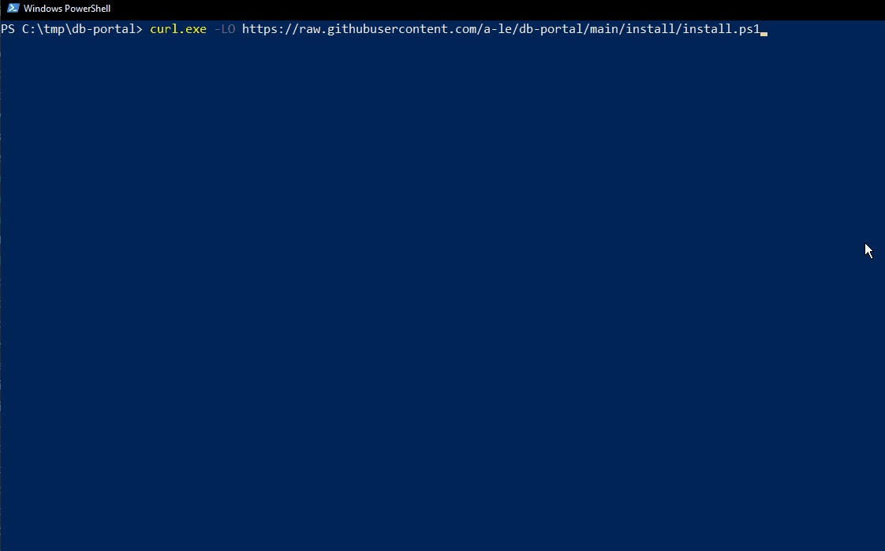
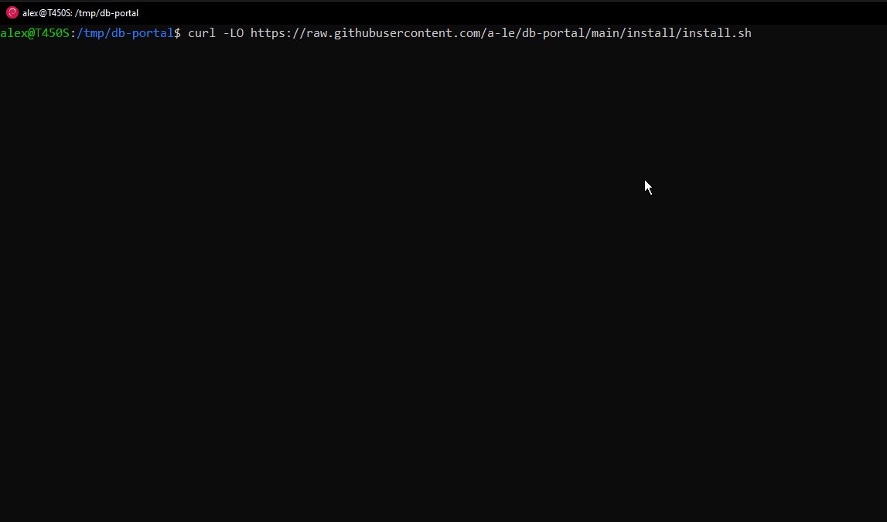

# db-portal

[](https://go.dev/dl/)
[](https://github.com/a-le/db-portal/blob/main/LICENSE)


## Project Description
**db-portal** is a cross-platform SQL editor with data dictionary browsing and light ETL features that runs as a Go HTTP server and is accessed through your browser.
It features an easy-to-use interface for ETL tasks. You can copy tabular data between different sources—including various database vendors, as well as Spreadsheet, JSON, and CSV files.

 It supports both single-user and multi-user modes with role-based permissions: admins have full control, while regular users can only access their assigned data sources.


## Table of Contents
- [Features](#features)
- [Demo](#demo)
- [Quick Install](#quick-install)
- [Roadmap](#roadmap)
- [Built With](#built-with)
- [Architecture Notes](#architecture-notes)
- [Server Configuration](#server-configuration)
- [Security Notice](#security-notice)

## Features

## 🔗data sources
Manage users and database connections.  
Not all operations are supported yet. For those, the default `admin` user has access to the `SQLite db-portal` data source.
To modify settings to your needs, simply execute SQL queries.

## 🗎 SQL editor
DSN connection with database/schema support.  
Simple editor with generic SQL syntax highlighting and paged results.  
Data dictionary information and SQL object definitions when feature is supported by the DB vendor.

## ⇄ copy data
Copy data from/to any of supported tabular data sources (database table or query, .xlsx, .csv, .json).

## Demo
Click on images to see full size. (v0.3.1)  
<table>
    <tr>
        <td>data sources
            <a href=".github/dataSources.gif" target="_blank">
                
            </a>
        </td>
        <td>SQL editor
            <a href=".github/sqlEditor.gif" target="_blank">
                
            </a>
        </td>
    </tr>
    <tr>
        <td>copy data
            <a href=".github/copyData.gif" target="_blank">
                
            </a>
        </td>
    </tr>
</table>

## Quick install
1. **Run the install script**

**Linux/macOS:**  
```bash
curl -LO https://raw.githubusercontent.com/a-le/db-portal/main/install/install.sh
bash install.sh
```

**Windows (PowerShell):**  
```powershell
curl.exe -LO https://raw.githubusercontent.com/a-le/db-portal/main/install/install.ps1
powershell -File install.ps1
```
<!--
1. For the time being, you should **build the app yourself** from source.
  With Go installed, `go build` in the source directory is all you need !
-->
2. Run executable: `db-portal --set-master-password=your_password`  
<sub>--set-master-password argument is only needed on the first run, or if you need to reset password.</sub>

3. **Open your browser and navigate to** [http://localhost:3000](http://localhost:3000)

4. **Log in with the `admin` user with the password set at step 2**  
---  
<table>
    <tr>
        <td>Windows installation
            <a href=".github/winInstall.gif" target="_blank">
                
            </a>
        </td>
        <td>Linux installation
            <a href=".github/linuxInstall.gif" target="_blank">
                
            </a>
        </td>
    </tr>
</table>

## Roadmap
- JS codebase reorganization and quality improvements
- Improve GUI integration of Data copy features and add abort execution support
- Add DuckDB support
- Support other data sources (server-accessible folders, HTTP/HTTPS JSON resources)
- Use a custom js/mithril component + Prism (syntax highligthning) as SQL Editor
- Use github actions for CI
- Load and save from the SQL Editor
- Enhance data dictionary functionality
- Support SQL scripts via CLI tools (psql, sqli etc...)
- Act as a http DB proxy for other apps
- Make REST APIs easier to use with curl or alternatives for scripting purposes
- Add tests


## Built With
- Go language
- Open source libraries  (see [go.mod](https://raw.githubusercontent.com/a-le/db-portal/main/go.mod) for a complete list of dependencies)
- [MithrilJS](https://mithril.js.org/) *a JavaScript framework for building fast and modular applications*
- [CodeMirror](https://codemirror.net/) *a powerful code editor component*
- Custom CSS for styling

## Architecture Notes
- Use RESTful APIs.
- User authentication via JSON Web Tokens (JWT).
- Configuration files auto-reload.
- User queries always use a new, clean connection to the database.
- UI queries will use a connection from the pool if supported.
- Use SQLite for data persistence

## Server configuration

server.yaml
```yaml
# Main configuration file
# Restart the server if you modify this file.

# Server address
# Host and port to listen on.
# Default is "localhost:3000"
addr: "localhost:3000"

# SQL editor
# Maximum number of rows in a result set.
# This applies only to results displayed in the SQL editor.
# Rows exceeding this limit will be discarded on the server side.
# The UI will display that the result set was truncated.
# Default is 500
max-resultset-length: 500

# Request timeout
# Database queries will be cancelled if they exceed the configured timeout.
# Default is 0 (no timeout)
timeout: 0

# HTTPS support
# Use mkcert (https://github.com/FiloSottile/mkcert) for easy self-signed certificates.
cert-file:
key-file:
```

## Security Notice
> **Warning:** Not recommended for direct internet exposure unless you fully understand the security implications and have performed your own review and hardening.
