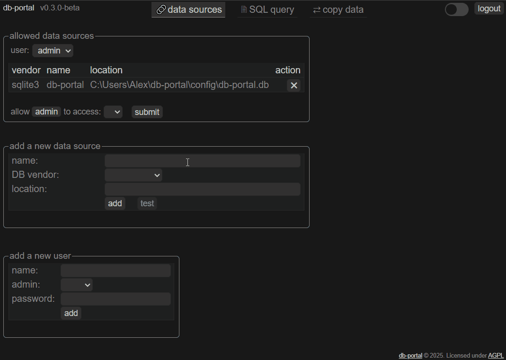

# db-portal

[](https://go.dev/dl/)
[](https://github.com/a-le/db-portal/blob/main/LICENSE)


`db-portal`
## Project Description
**db-portal**, a cross-platform SQL editor with data dictionary browsing and light ETL features.  
It runs as a Go HTTP server and is accessed through your browser.  
It features an easy-to-use interface for ETL tasks. You can copy data between different sources—including various database vendors, as well as Excel, JSON, and CSV files.

It supports both solo and multi-user modes with role-based permissions where admins have full control, while regular users can only access their assigned data sources. 

## Demo (v0.3.1)
Cick on images to see full size.  
<table>
    <tr>
        <td>Manage data sources (DSN)
            <a href=".github/dataSources.gif" target="_blank">
                
            </a>
        </td>
        <td>SQL editor
            <a href=".github/sqlEditor.gif" target="_blank">
                
            </a>
        </td>
    </tr>
    <tr>
        <td>Copy data page
            <a href=".github/copyData.gif" target="_blank">
                
            </a>
        </td>
    </tr>
</table>

<table>
    <tr>
        <td>Windows installation
            <a href=".github/winInstall.gif" target="_blank">
                
            </a>
        </td>
        <td>Linux installation
            <a href=".github/linuxInstall.gif" target="_blank">
                
            </a>
        </td>
    </tr>
</table>

## Table of Contents
- [Features](#features)
- [App Maturity](#app-maturity)
- [Quick Installation](#quick-installation)
- [Roadmap](#roadmap)
- [Built With](#built-with)
- [Architecture Notes](#architecture-notes)
- [Server Configuration](#server-configuration)
- [Configuration](#configuration)

## Features
- Query your databases through a unified web interface in your browser
- Supports the following DB vendors: ClickHouse, MySQL/MariaDB, MSSQL, PostgreSQL and SQLite.
- Write SQL queries in a syntax-highlighted minimalist editor
- View query results in a smart HTML table
- Browse data dictionaries (tables, columns, views, procedures)

- ETL features
  - Use a GUI for ETL operations. Set source and destination, click submit and voilà ! 
  - Data sources supported (as source or destination): DB table, DB query, .json (2 formats supported), .xlsx, .csv 

- Solo or multi-user support
  - Solo: Simply add data sources (DSN), assign them to your user, and start using them.
  - Multi-user: Add users and DSN, then assign DSN to specific users for controlled access.
  - Regular users can only access the data sources and connections assigned to them, whereas admins have unrestricted access to all resources.

- Implements industry-standard authentication and security practices
  - Server based with HTTPS support
  - Secure authentication via JWT

- Developer friendly
  - No CGO required for building from source
  - Instantly see changes to `.js` (`.js` files are combined and minified on the fly) 

- Light and efficient
  - Minimal CPU and memory usage
  - Custom JavaScript and CSS using a lightweight virtual DOM library (Mithril.js)

- Cross-platform support: Windows, Linux, Mac OS and other OSes supported by Go
- **see [CHANGELOG.md](https://raw.githubusercontent.com/a-le/db-portal/main/CHANGELOG.md) for latest features**


## App maturity
- > **Warning:** Not recommended for direct internet exposure unless you fully understand the security implications and have performed your own review and hardening.


## Quick Installation
1. **Run the install script**

**Linux/macOS:**  
```bash
curl -LO https://raw.githubusercontent.com/a-le/db-portal/main/install/install.sh
bash install.sh
```

**Windows (PowerShell):**  
```powershell
curl.exe -LO https://raw.githubusercontent.com/a-le/db-portal/main/install/install.ps1
powershell -File install.ps1
```
<!--
1. For the time being, you should **build the app yourself** from source.
  With Go installed, `go build` in the source directory is all you need !
-->
2. Run executable: `db-portal --set-master-password=your_password`  
<sub>--set-master-password argument is only needed on the first run, or if you need to reset password.</sub>

3. **Open your browser and navigate to** [http://localhost:3000](http://localhost:3000)

4. **Log in with the `admin` user with the password set at step 2**  

---


## Roadmap / upcoming / ideas
- JS codebase reorganization and quality improvements
- Improve GUI integration of Data copy features and add abort execution support
- Add DuckDB support
- Use DuckDB for ETL task of reading XLSX files ?
- Support base folders as data source for files ?
- Replace CodeMirror by Prism (syntax highligthning) + custom js/mithril editor.
- use github actions for CI
- Load and save query/script files
- Enhance data dictionary functionality
- Support SQL scripts via CLI tools (psql, sqli etc...)
- Act as a http DB proxy for other apps
- add tests
- Split the project into 2 separate repositories: server (Go backend) and client (web frontend) ?


## Built With
- Go language
- Open source libraries  (see [go.mod](https://raw.githubusercontent.com/a-le/db-portal/main/go.mod) for a complete list of dependencies)
- [MithrilJS](https://mithril.js.org/) *a JavaScript framework for building fast and modular applications*
- [CodeMirror](https://codemirror.net/) *a powerful code editor component*
- Custom CSS for styling

## Architecture Notes
- Use RESTful APIs.
- User authentication via JSON Web Tokens (JWT).
- Configuration files auto-reload.
- User queries always use a new, clean connection to the database.
- UI queries will use a connection from the pool if supported.
- Use SQLite for data persistence

## Server configuration

server.yaml
```yaml
# Main configuration file
# Restart the server if you modify this file.

# Server address
# Host and port to listen on.
# Default is "localhost:3000"
addr: "localhost:3000"

# SQL editor
# Maximum number of rows in a result set.
# This applies only to results displayed in the SQL editor.
# Rows exceeding this limit will be discarded on the server side.
# The UI will display that the result set was truncated.
# Default is 500
max-resultset-length: 500

# Request timeout
# Database queries will be cancelled if they exceed the configured timeout.
# Default is 0 (no timeout)
timeout: 0

# HTTPS support
# Use mkcert (https://github.com/FiloSottile/mkcert) for easy self-signed certificates.
cert-file:
key-file:
```

## Manage users and database connections
Common tasks now have a GUI.
For operations that are not yet supported, 
db-portal uses internally a SQLite database with a few tables.
As shipped, the default `admin` user is allowed to the `SQLite db-portal` data source.
To modify to your needs, you simply have to execute SQL queries.
